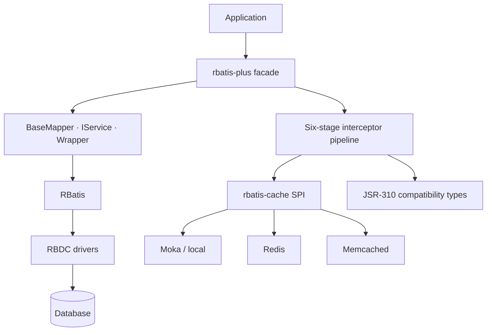

# Ecosystem architecture and boundaries

This diagram describes repository and runtime responsibilities. It does not imply that every node is a stable release; check the catalog for status.

## Verified boundaries

- `rbatis-plus` is currently 0.1.0-alpha.1: an executable vertical slice, not full MyBatis-Plus parity.
- Interceptor order is fixed: SQL_REWRITE, PARAMETER_TRANSFORM, EXECUTE, RESULT_VERIFY, RESULT_TRANSFORM, OBSERVE.
- Caching applies only to parsed SELECT statements outside transactions; backend errors fail open to the database path and remain observable.

## Suggested reading order

1. Find the entry point closest to your use case in the diagram.
2. Confirm whether the repository is public, a private preview, or archived.
3. Open its README and confirm API, version, tests, and license.
4. Run the smallest verification from Getting Started before business integration.
