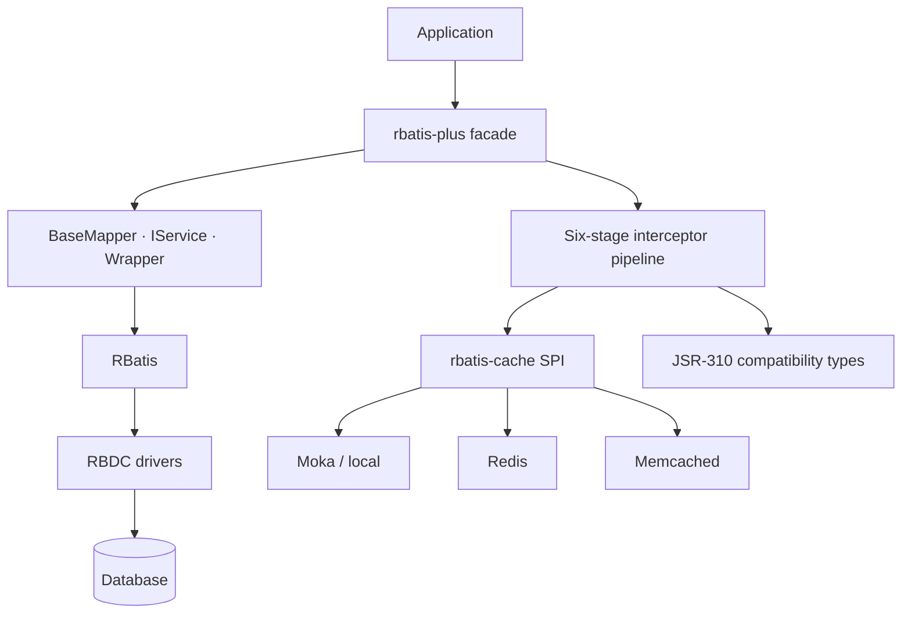

# 生态架构与边界

这张图描述的是仓库和运行时的职责关系，不代表所有节点都已达到稳定发布状态。状态请回到项目目录逐项确认。

## 已验证的边界

- `rbatis-plus` 当前为 0.1.0-alpha.1，可执行垂直切片不等于 MyBatis-Plus 全量兼容。
- 拦截器顺序固定为 SQL_REWRITE、PARAMETER_TRANSFORM、EXECUTE、RESULT_VERIFY、RESULT_TRANSFORM、OBSERVE。
- 缓存只处理事务外已解析 SELECT；后端错误 fail-open 到数据库路径，并保留可观测性。

## 阅读顺序

1. 先从图中找到与你的用例最接近的入口。
2. 在项目目录确认该仓库是公开、private preview 还是已归档。
3. 进入目标仓库 README，核对 API、版本、测试与许可证。
4. 按快速开始执行最小验证，再进入业务集成。
